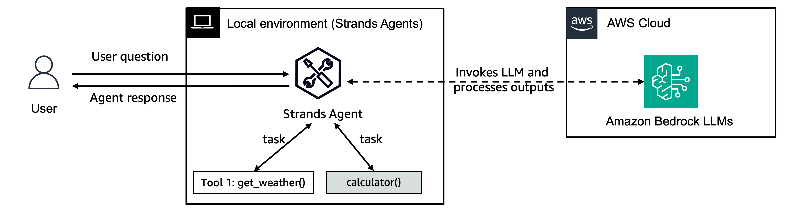

# Strands Agents を使い始める

このガイドは、Strands Agents の基本概念を理解し、最初のエージェントを使い始めるのに役立ちます。

## 前提条件

- Python 3.10 以降
- 適切な権限が設定された AWS アカウント
- Python プログラミングの基礎知識

## インストール

pip を使用して、Strands Agents とツールパッケージをインストールします。

```bash
pip install strands-agents strands-agents-tools
```

## 基本概念

Strands Agents は、AWS サービスと連携して複雑なタスクを実行できる AI エージェントを構築するためのフレームワークです。主要なコンポーネントは次のとおりです。

1. **エージェント**: 会話を管理し、ツールを調整するコアコンポーネント
2. **モデル**: エージェントの基盤となる大規模言語モデル（LLM）
3. **ツール**: エージェントが特定のタスクを実行するために使用できる関数
4. **セッションと状態**: 対話全体にわたって会話履歴とエージェントの状態を維持するためのメカニズム
5. **エージェントループ**: エージェントが入力を受け取り、処理し、応答を生成するプロセスフロー
6. **コンテキスト管理**: エージェントが会話コンテキスト（記憶と取得を含む）を維持および管理する方法

## クイックスタートガイド

このディレクトリにある `01-first-agent.ipynb` ノートブックには、以下のコード例を含む包括的なガイドが含まれています。

1. **シンプルなエージェントの作成**: システムプロンプトを使用して基本的なエージェントを初期化する方法を学びます。
2. **ツールの追加**: 組み込みツールとカスタムツールを使用してエージェントを強化する方法を学びます。
3. **ログの設定**: 適切なログを設定します。デバッグとモニタリング用
4. **エージェントのカスタマイズ**: 様々なモデルを選択し、パラメータを設定します

## サンプルの実行

このフォルダには、開始に役立つ入門ノートブックとシンプルなユースケースが含まれています。

1. **01-first-agent.ipynb**: 包括的なクイックスタートガイドとユースケースを含む Jupyter ノートブック。

ここでは、以下のものを構築します。


そして、以下のレシピエージェントを構築します。


2. **02-simple-interactive-usecase/**: CLI 経由で実行するシンプルなインタラクティブな調理/レシピエージェントを含むディレクトリ。

インタラクティブエージェントを実行するには：

1. ディレクトリに移動します: `cd 02-simple-interactive-usecase`
2. 要件をインストールします: `pip install -r requirements.txt`
3. スクリプトを実行します: `python recipes_bot.py`

## リソース

- より詳細なガイドについては、[Strands ドキュメント](https://strandsagents.com/latest/user-guide/quickstart/) をご覧ください。
- [セッションと状態](https://strandsagents.com/latest/user-guide/concepts/agents/sessions-state) について詳しく学習します。
- [エージェントループ](https://strandsagents.com/latest/user-guide/concepts/agents/agent-loop/) を理解します。
- [コンテキスト管理](https://strandsagents.com/latest/user-guide/concepts/agents/context-management/) について詳しく学習します。
- [strands-agents-tools](https://github.com/strands-agents/tools) は、実装済みのツールをまとめたリポジトリです。
- システムプロンプトをカスタマイズし、関連ツールを追加することで、タスクに特化した独自のエージェントを構築してみましょう。

Strands Agents で楽しい開発を！🚀