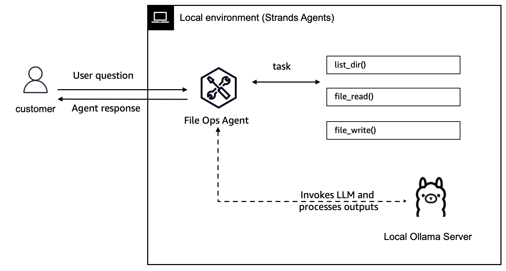
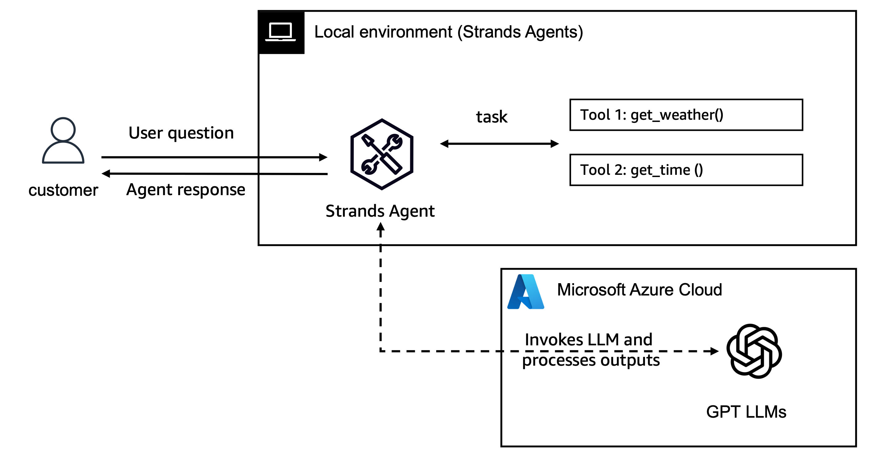

## Strands Agents のモデルプロバイダー

Strands Agents は複数のモデルプロバイダーをサポートしており、特定のユースケースに最適な基盤モデルを選択できます。この柔軟性により、さまざまな機能、コスト構造、デプロイメントオプションを活用できるエージェントを構築できます。
サポートされているモデルプロバイダー

Strands Agents は、複数のモデルプロバイダーを標準でサポートしています。

1. [**AWS Bedrock**](https://strandsagents.com/0.1.x/user-guide/concepts/model-providers/amazon-bedrock/): Amazon のマネージドサービスを利用して、Anthropic、Meta、Amazon などの主要プロバイダーが提供する高性能な基盤モデルにアクセスできます。
2. [**Anthropic**](https://strandsagents.com/0.1.x/user-guide/concepts/model-providers/anthropic/): Claude モデルへの直接 API アクセス
3. [**Ollama**](https://strandsagents.com/0.1.x/user-guide/concepts/model-providers/ollama/): プライバシー保護やオフライン使用のためにモデルをローカルで実行できます。
4. [**LiteLLM**](https://strandsagents.com/0.1.x/user-guide/concepts/model-providers/litellm/): OpenAI、Mistral、その他のプロバイダー向けの統合インターフェース
- **Azure OpenAI**: Microsoft Azure でホストされている OpenAI モデルを活用
- **OpenAI**: GPT-4/gpt-4o などのモデルにアクセス
5. [**カスタムプロバイダー**](https://strandsagents.com/0.1.x/user-guide/concepts/model-providers/custom_model_provider/): 特殊なニーズに合わせて独自のプロバイダーを構築

## モデルチュートリアル
このフォルダには 2 つのサンプルが含まれています。

1. [Ollama](./01-ollama-model/):
シンプルな操作 (`file_read`、`file_write`、`list_directory`) を実行できるローカルファイルオペレーションエージェントの例を紹介します。拡張することで、より多くのツールを追加し、より高度な機能を実現できます。

アーキテクチャは以下のとおりです。

2. [LiteLLM 経由の OpenAI アクセス](./02-openai-model/):
Azure 経由で OpenAI モデルにアクセスできるシンプルなエージェントの例を示します。このエージェントは、`current_weather` や `current_time` などの基本的なツールにアクセスできます。

アーキテクチャは以下のとおりです。

注: すべてのモデルで、[コールバック ハンドラー](https://strandsagents.com/0.1.x/user-guide/concepts/streaming/callback-handlers/) を追加できます。これにより、エージェント実行中にイベントをインターセプトして処理できます。
